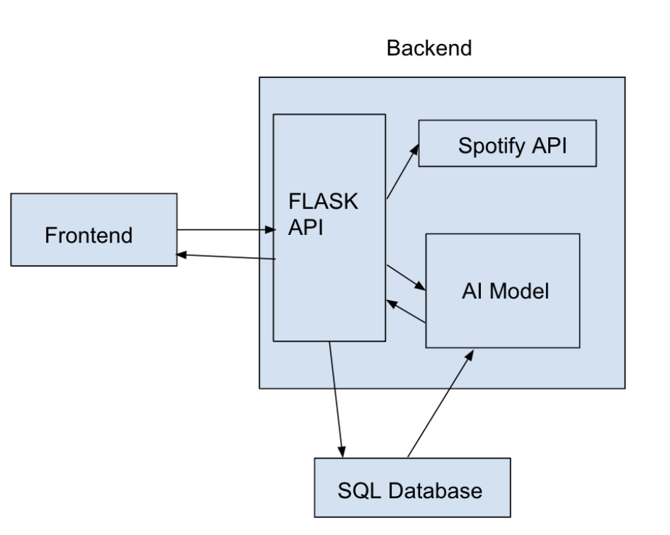

# TuneAI

## Introduction

TuneAI is a  mobile app that recommends users songs based on their listening preferences and swipe feedback.
Using uploaded Spotify playlists and continued user input over time, the app learns to understand user music preferences.

## Features

1. Login with your Spotify account to access music.
2. Upload your own playlists to find similar songs.
3. Play song snippets similar to your preferences.
4. Swipe right to add to a playlist or swipe left to ignore.
5. Create or add to a curated playlist that can be sent back to Spotify for your listening experience.

## App Architecture

<div style="text-align: center;">
    
</div>

## Technologies Used

- React Native
- Flask
- Spotify Web API
- PostgreSQL
- AWS (Amazon RDS)

## Installation Guide

### 1. Clone the Repository

Clone the repository and change into the main directory:

```bash
git clone https://github.com/CS222-UIUC/team-08-project.git
cd team-08-project
```

### 2. Python Backend Setup

Install Python project dependencies from requirements.txt:

``` bash
pip install -r requirements.txt
```

### 3. React Native Frontend Setup

Install Node.js project dependencies from package.json:

``` bash
npm install
```

### 4. Start Backend Server and Run App

To run the Flask server, navigate to the server folder and start the app:

```bash
cd server
python routes.py
```

To run the React Native app, navigate back to the main directory and start:

```bash
cd ..
npx expo start
```


## Contributors

- Siddharth Dayaneni (Backend)
- Shreyas Talluri (Backend)
- Krish Mewade (Frontend)
- Heta Patel (Frontend)
